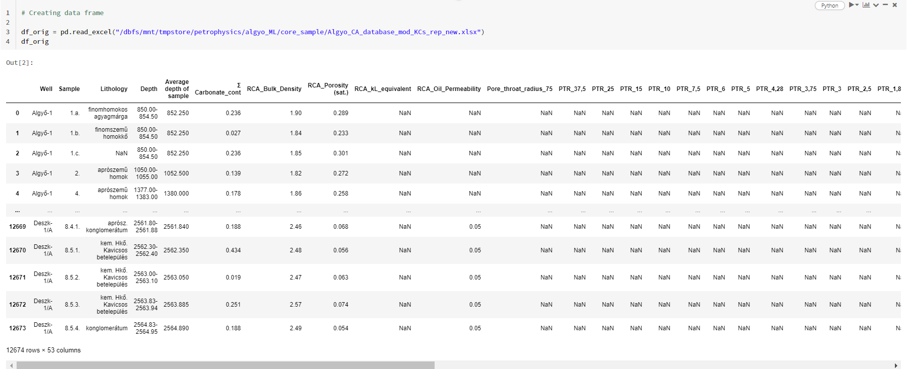
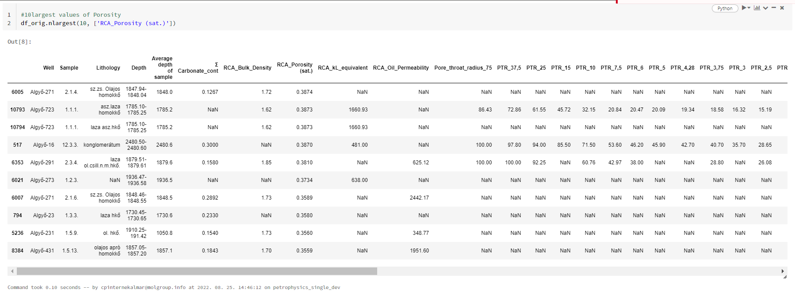
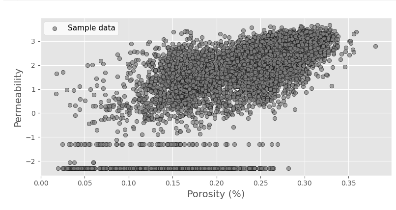
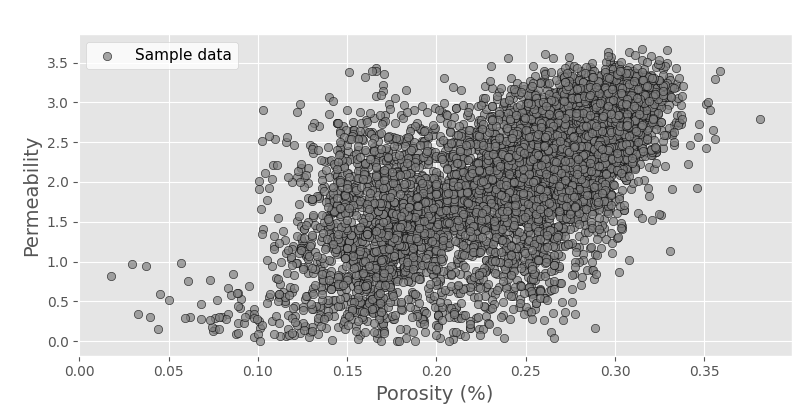

# Bevezető
Az Algyő ML projektmunka során log adatokat mellett a magadatok is rendelkezésünkre állnak.
A magokból nyert adatokat Kutasi Csaba biztosította számunkra egy excel táblázat formájában.
A táblázatban a teljesség igénye nélkül, a legfontosabb paraméterek a következők:
-	Az adott kút neve, amiből történt a mintavétel
-	A minta száma
-	A mintavétel mélysége (range)
-	Karbonáttartalmom
-	Porozitás
-	Permeabilitás


# Elemzés lépései
## Adattisztítás
Első lépésként átnéztem az adatokat, ahol bármi problémát láttam, ami későbbiekben hatással lehet az elemzés eredményére, kezeltem.

### 
A mélységtartomány oszlopból létrehoztam egy átlagos mélység oszlopot. 

```Python
#Adatok beolvasása
df_orig = pd.read_excel("/dbfs/mnt/tmpstore/petrophysics/algyo_ML/core_sample/Algyo_CA_database_mod_KCs_rep_new.xlsx")
#Az adatok beolvasása után néztem egy statisztikát
df_orig.describe()
# a karbonáttartalom megjelenítése pontdiagrammon
df_orig.plot(kind='scatter',x='Well',y='Ʃ Carbonate_cont')
#Sorba rendeztem a porozitás értékek alapján az adatokat
df_orig.nlargest(10, ['RCA_Porosity (sat.)'])
```

Ugyanezt a vizuális megjelenítést és sorbarendezést megismételtem a permeabilitás illetve a karbonáttartalom esetében is.

Mivel nagyon sok 0 értéket tartalmazott a táblázat, így azokat a sorokat, ahol a porozitás és permeabilitás értéke is 0, kiszedtem.
```Python
#Azon sorok eldobása, ahol a porozitás és permeabilitás értéke is 0, vagy Nan
df_orig_without0 = pd.DataFrame(df_orig[(df_orig[['RCA_Porosity (sat.)','RCA_Oil_Permeability']] != 0).all(axis=1)])
df_mod = df_missing_fill.dropna()
df_mod = df_mod.reset_index(drop=True)
#A porozitás és permeabilitás 
plt.style.use('default')
plt.style.use('ggplot')
fig, ax = plt.subplots(figsize=(8, 4))
ax.scatter(A, B, edgecolor='k', facecolor='grey', alpha=0.7, label='Sample data')
ax.set_ylabel('Permeability', fontsize=14)
ax.set_xlabel('Porosity (%)', fontsize=14)
ax.legend(facecolor='white', fontsize=11)
fig.tight_layout()
```


A cross ploton látható, hogy több esetben előfordul, hogy a permeabilitás értékek minusz értékeket vesznek fel. Ezeket az értékeket eltávolítottam az adatkészletből. E mellett az olyan adatpontok is eltávolításra kerültek, ahol ahol a porozitás értéke <=1, míg a permeabilitás értéke >=1 volt.  
Így előállt a végső, tisztított adatbázis, amin az elemzéseket végeztük.


