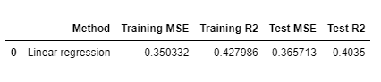
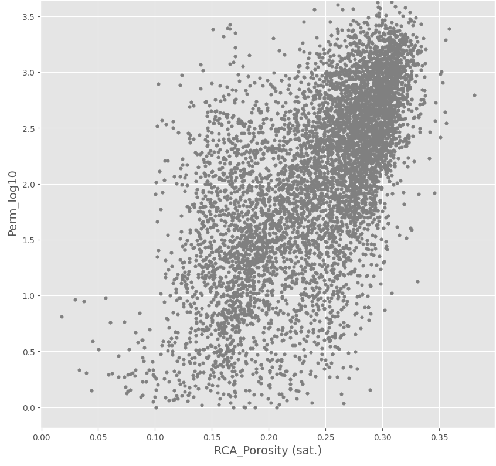
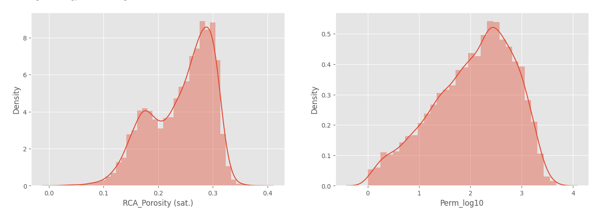
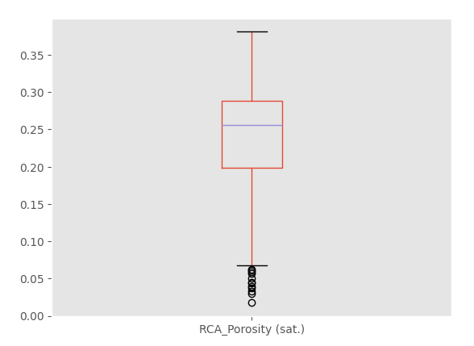
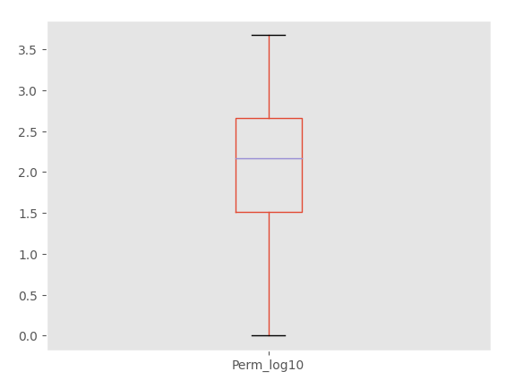
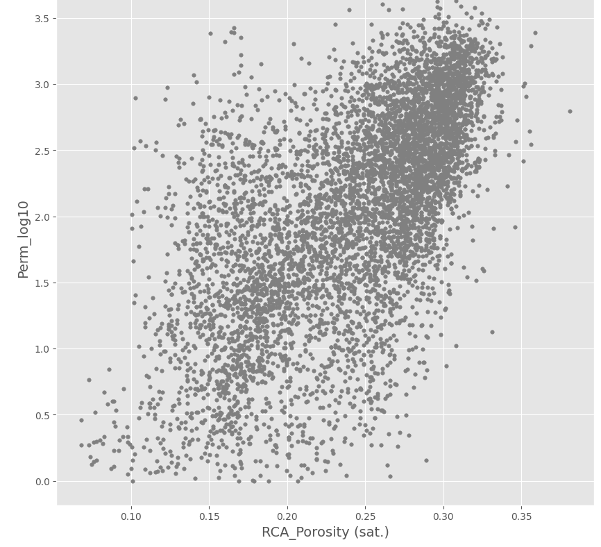
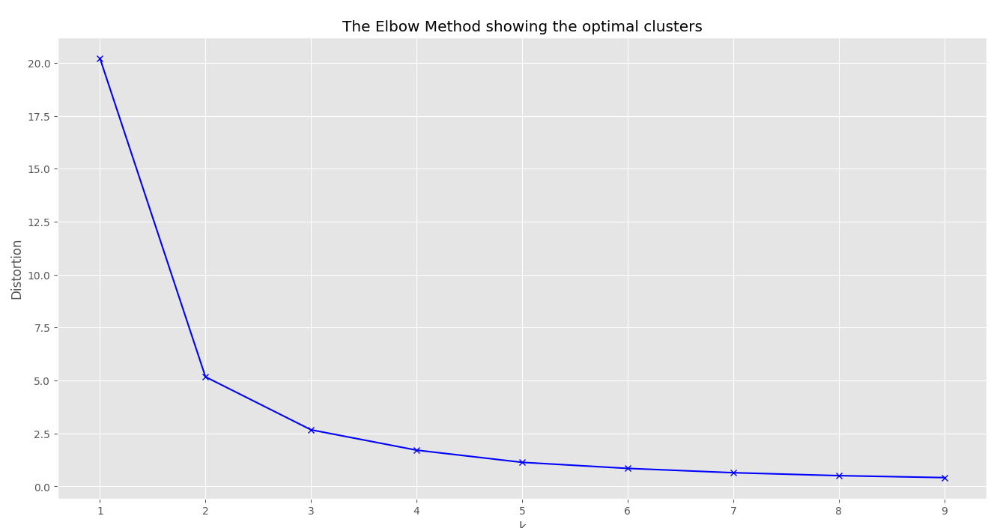
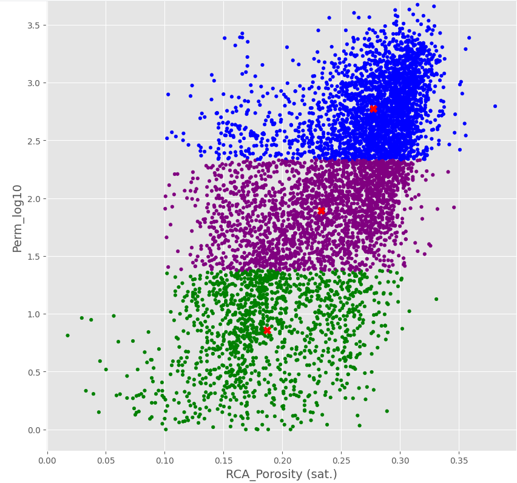

# Bevezető
Az Algyő ML projektmunka során log adatokat mellett a magadatok is rendelkezésünkre állnak.
A magokból nyert adatokat Kutasi Csaba biztosította számunkra egy excel táblázat formájában.
A táblázatban a teljesség igénye nélkül, a legfontosabb paraméterek a következők:
-	Az adott kút neve, amiből történt a mintavétel
-	A minta száma
-	A mintavétel mélysége (range)
-	Karbonáttartalmom
-	Porozitás
-	Permeabilitás


# Elemzés lépései
## Adattisztítás
Első lépésként átnéztem az adatokat, ahol bármi problémát láttam, ami későbbiekben hatással lehet az elemzés eredményére, kezeltem.

A mélységtartomány oszlopból létrehoztam egy átlagos mélység oszlopot. 

```Python
#Read data
df_orig = pd.read_excel("/dbfs/mnt/tmpstore/petrophysics/algyo_ML/core_sample/Algyo_CA_database_mod_KCs_rep_new.xlsx")
#Statistics based on the raw data
df_orig.describe()
# Plot the Carbonate content 
df_orig.plot(kind='scatter',x='Well',y='Ʃ Carbonate_cont')

# Sort the data based on the porosity and peremability values 
df_orig.nlargest(10, ['RCA_Porosity (sat.)'])
```

Ugyanezt a vizuális megjelenítést és sorbarendezést megismételtem a permeabilitás illetve a karbonáttartalom esetében is.

Mivel nagyon sok 0 értéket tartalmazott a táblázat, így azokat a sorokat, ahol a porozitás és permeabilitás értéke is 0, kiszedtem.
```Python
#Drop the rows where the porosity and permeability is zero or Nan
df_orig_without0 = pd.DataFrame(df_orig[(df_orig[['RCA_Porosity (sat.)','RCA_Oil_Permeability']] != 0).all(axis=1)])
df_mod = df_missing_fill.dropna()
df_mod = df_mod.reset_index(drop=True)

#Porosity and Permeability crossplot
plt.style.use('default')
plt.style.use('ggplot')
fig, ax = plt.subplots(figsize=(8, 4))
ax.scatter(A, B, edgecolor='k', facecolor='grey', alpha=0.7, label='Sample data')
ax.set_ylabel('Permeability', fontsize=14)
ax.set_xlabel('Porosity (%)', fontsize=14)
ax.legend(facecolor='white', fontsize=11)
fig.tight_layout()
```


A cross ploton látható, hogy több esetben előfordul, hogy a permeabilitás értékek minusz értékeket vesznek fel. Ezeket az értékeket eltávolítottam az adatkészletből. E mellett az olyan adatpontok is eltávolításra kerültek, ahol ahol a porozitás értéke <=1, míg a permeabilitás értéke >=1 volt.  
Így előállt a végső, tisztított adatbázis, amin az elemzéseket végeztük.


## Lineáris regresszió 

A modellezéshez 3 paramétert:
-   Porozitást
-	Permeabilitást
-	Karbonáttartalmat
használtuk fel. 

Mivel a permeabilitás és a porozitás között szerettünk volna egy összefüggést találni, így első lépésben nem bontottam szét az adathalmazt training és testing részekre. Az X-nek(featurenek) a porozitást, míg az y-nak, a célváltozónak a permebailitás értékeit adtam meg.

```Python
#Define X and y parameters
X = df_mod_new2['RCA_Porosity (sat.)'].values.reshape(-1,1)
y = df_mod_new2['Perm_log10'].values

#Linear regression
from sklearn import linear_model
ols = linear_model.LinearRegression()
model = ols.fit(X, y)
response = model.predict(X)
r2 = model.score(X, y)

from sklearn.metrics import mean_squared_error, r2_score
lr_mse = mean_squared_error(y, response)
lr_r2 = r2_score(y, response)

#Data visualization
plt.style.use('default')
plt.style.use('ggplot')
fig, ax = plt.subplots(figsize=(8, 4))
ax.plot(X, response, color='k', label='Regression model')
ax.scatter(X, y, edgecolor='k', facecolor='grey', alpha=0.7, label='Sample data')
ax.set_ylabel('Permeability', fontsize=14)
ax.set_xlabel('Porosity (%)', fontsize=14)
ax.legend(facecolor='white', fontsize=11)
ax.set_title('$R^2= %.2f$' % r2, fontsize=18)
fig.tight_layout()
```


## Klaszterezés

Ez után létrehoztam egy új X DataFramet, ahol a porozitást illetve a permeabilitást is feature-ként adtam meg. A permeabilitás értékeket átraktam logaritmikus skálára. Az értékeket a látható crossploton jelenítettem meg. 



Ezután megjelenítettem vizuálisan az eloszlásukat



Boxplotok segítségével megvizsgáltam, hogy az egyes tulajdonságok értékeiben vannak-e kiugró értékek. Az alábbi ábrán láthatóak az előállított boxplotok




Látható, hogy a porozitás esetében vannak outlier értékek az adatok között. Ezeket az outlier értékeket eltávolítottam és előállítottam egy új, tisztított adatbázist.
Ezt a tisztított adatbázist vizuálisan megjelenítettem.

```Python
plt.figure(figsize=(10,10))
plt.scatter(X_array_cleaned['RCA_Porosity (sat.)'],X_array_cleaned['Perm_log10'],s=15,color='grey')
plt.title('Dataset',fontsize=20)
plt.xlabel('RCA_Porosity (sat.)',fontsize=14)
plt.ylabel('Perm_log10',fontsize=14)
plt.show()
```



```Python
#Define the number of clusters with the help of the Elbow-method

import pandas as pd
import numpy as np
import matplotlib.pyplot as plt
from sklearn.cluster import KMeans
from sklearn import datasets

# Collecting the distortions into list
distortions = []
K = range(1,10)
for k in K:
 kmeanModel = KMeans(n_clusters=k)
 kmeanModel.fit(X)
 distortions.append(kmeanModel.inertia_)
# Plotting the distortions
plt.figure(figsize=(16,8))
plt.plot(K, distortions,'bx-')
plt.xlabel('k')
plt.ylabel('Distortion')
plt.title('The Elbow Method showing the optimal clusters')
plt.show()
```


A klaszterezést k-Means klaszterezéssel hajtottuk végre. Meghatároztuk a klaszter centereket és kirajzoltattuk az eredményt.

```Python
#K-Means clustering
from sklearn.cluster import KMeans
k_means=KMeans(n_clusters=3,random_state=42)
k_means.fit(X_array[['RCA_Porosity (sat.)','Perm_log10']])

#Define the cluster_centers
k_means.cluster_centers_


import matplotlib.colors
X_array['KMeans_labels']=k_means.labels_

# Plotting resulting clusters
colors=['purple','red','blue','green']
plt.figure(figsize=(10,10))
plt.scatter(X_array['RCA_Porosity (sat.)'],X_array['Perm_log10'],c=X_array['KMeans_labels'],cmap=matplotlib.colors.ListedColormap(colors),s=15)
plt.scatter(k_means.cluster_centers_[:,0], k_means.cluster_centers_[:,1], 
            marker="X", c="r", s=80, label="centroids")
plt.title('K-Means Clustering',fontsize=20)
plt.xlabel('RCA_Porosity (sat.)',fontsize=14)
plt.ylabel('Perm_log10',fontsize=14)
plt.show()
```



```Python
# Define the clusters
k_means_IQR=KMeans(n_clusters=3,random_state=42)
k_means_IQR.fit(X_array_cleaned[['RCA_Porosity (sat.)','Perm_log10']])
predict=k_means.predict(X_array_cleaned)
X_array_cleaned['clusters'] = pd.Series(predict, index=X_array_cleaned.index)

```
