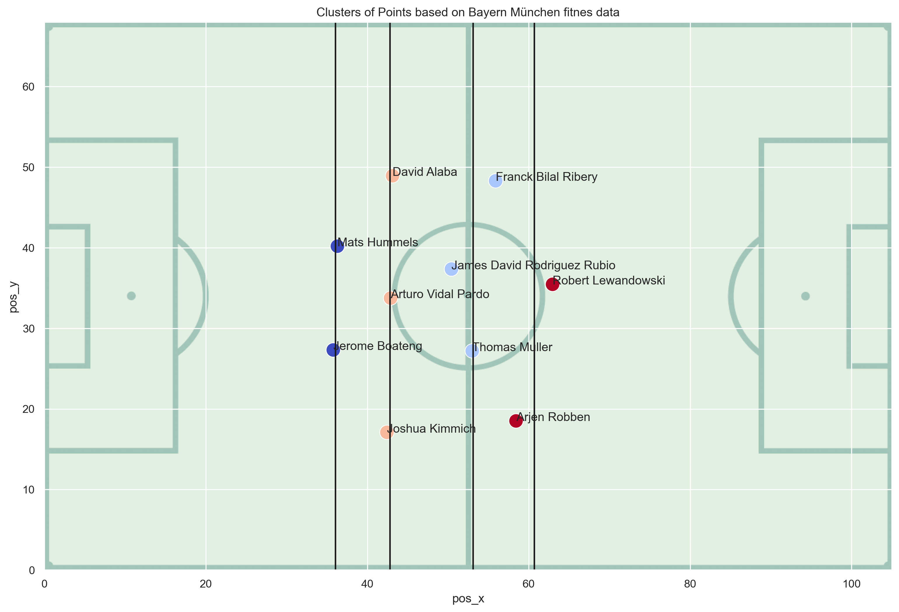
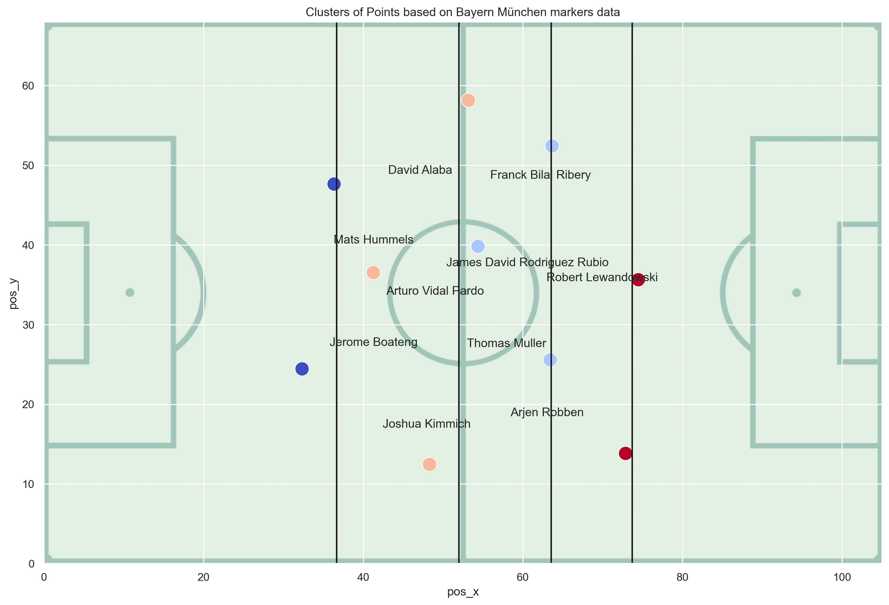
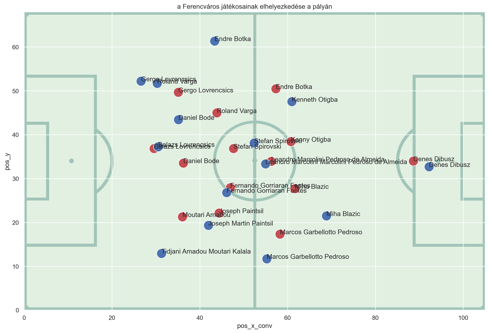
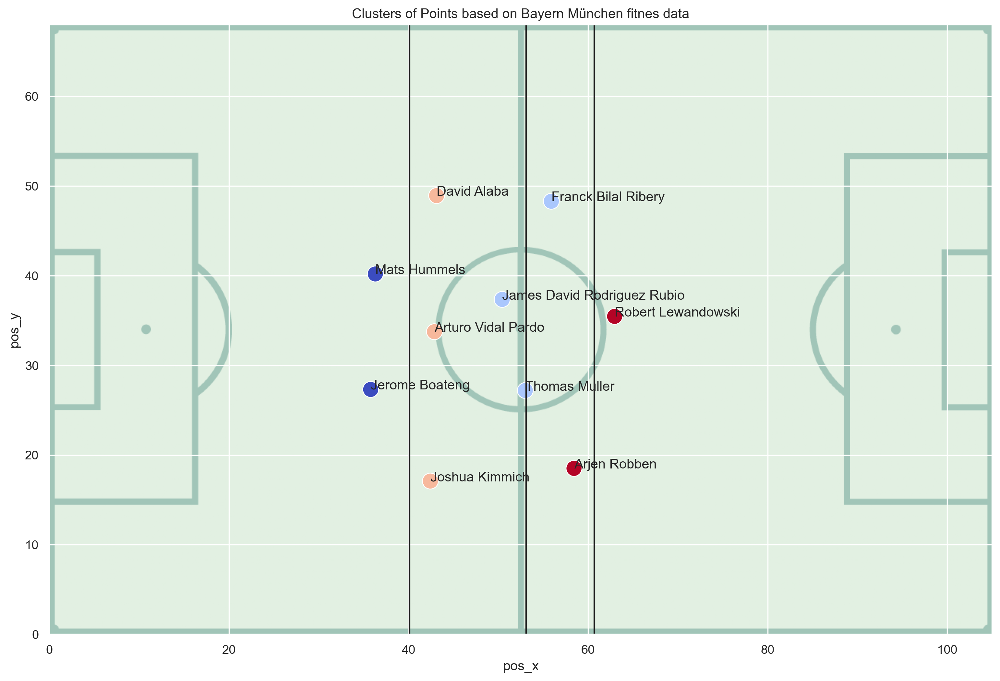
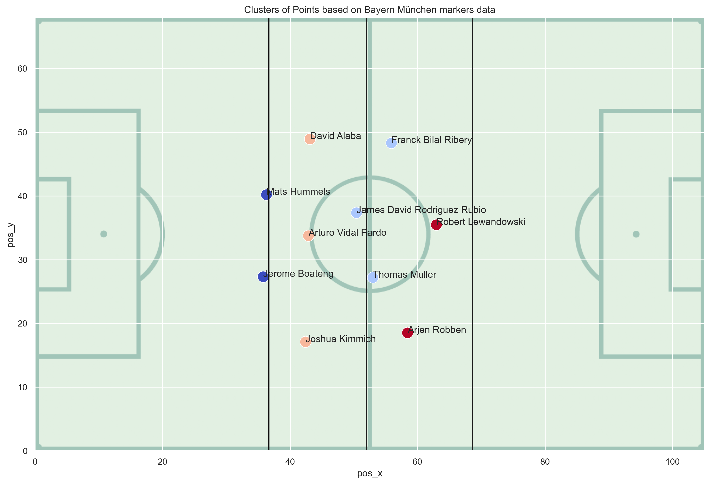
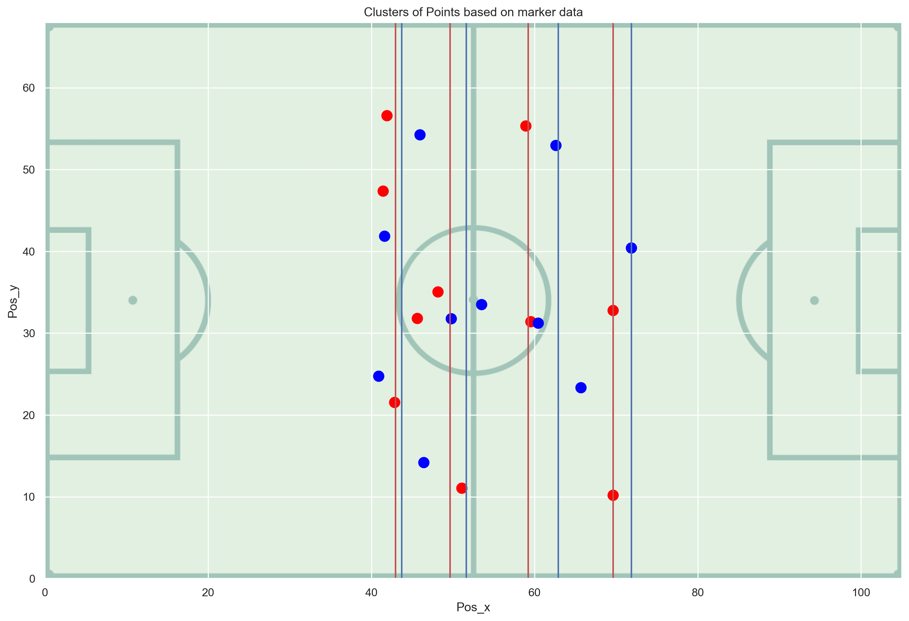
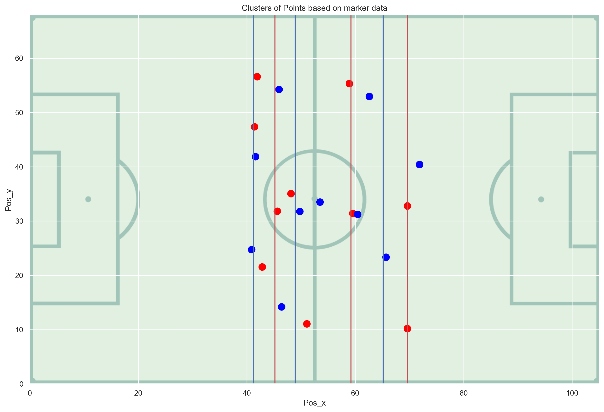
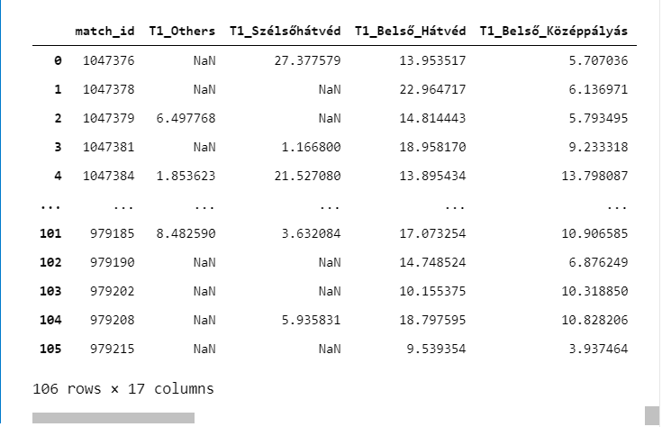
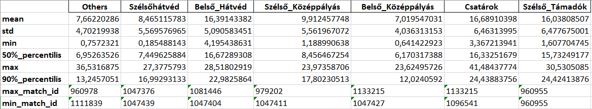
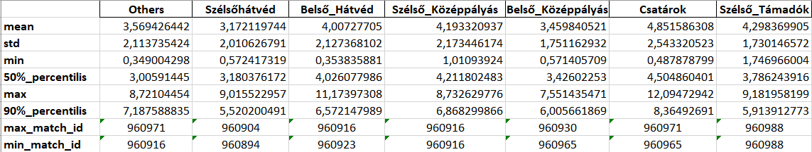

# Bevezető
A teljesítményelemzés területén a hagyományos **event** adatok mellett,  megjelent és széles körben elérhetővé vált egy másik fajta adatforrás is, a **tracking** adatok. 
Az event adatokkal ellentétben a tracking adatok nem pusztán a labdás eseményeket (on-the-ball events) rögzítik, hanem egy sokkal teljesebb körű elemzést kínálnak a pálya teljes területén.

Az event (vagy más néven markers) adatok a meccs teljes ideje alatt rögzítik a labdás eseményeket. Minden akciót különböző actions-re osztanak fel (pl.: passz, gólpasszokat, rálövések, blokk, szabálytalanságokat, stb..), amelyekhez hozzárendelik az egyes játékosok pozicióit, illetve az akció pontos időpontját is. Az event adatok tehát zajosak, mivel kézzel történik a besorolásuk. A jegyzett események általában több méterrel és több másodperccel torzítanak a valósághoz képest. Ezen kívül az events adatok csak részleges képet nyújtanak a történésekről, mivel csupán a labdás eseményeket rögzítik, ezáltal figyelmen kívül hagyva a többi 20-21 játékos akcióit, akik nem vesznek részt közvetlenül a labdás akcióban.  Az events adatok tehát a pályán történt eseményeknek csupán töredékét, kb az idő kis százalékát rögzítik, mivel az akciók döntő többsége labda nélkül történik. Az events adatok olcsóbbak, több szolgáltató forgalmazza őket és több bajnokságra elérhetők, illetve viszonylag sok (évekkel ezelőtti) adat érhető el bárki számára. 
Az event adatokkal szemben, a tracking (más néven fitness) adatok minden másodperceben rögzítik a pályán lévő játékosok helyzetét, így egy teljesebb körű adatbázist jelentenek.   
A fizikai aktivitás a teljes csapatról és a mérkőzés minden egyes játékosákról információval szolgál. Jelzi a futás sebességét, az aktivitás növekedését/ csökkenését, a megtett távolságot, stb... Tehát a fizikai aktivitás egy nagyon hasznos eszköz mind az edzők, mind a játékosok számára egyaránt. Az Instat fitness riportok önálló statisztikai eszközök, melyek teljeskörű információt nyújtanak a teljes csapat mérkőzésen nyújtott teljesítményéről. Az Instat fitness meggyőző és egyszerű megoldás a játékosok fizikai aktivitásának elemzéséhez. Statikus kamerát telepítenek a stadionba, majd a videó automatikusan átalakul 2D -s modellvé. Ez az eszköz segít megérteni, hogy a fáradtság hogyan befolyásolja a játékosok teljesítményét, illetve segítségével következtetéseket lehet levonni a csapat általános fizikai állapotáról. A video segítségével bármikor megvizsgálhatjuk pl a játékosok sebességét, vagy hogy mekkora volt a távolság a védők között, amikor hibáztak. Ellenőriztetik a játékosok saját paramétereiket illetve az ellenfelekét is. Megmutatja, hogy melyik játékos tett meg nagyobb távolságot, vagy ami még fontosabb, ki sprintelt többet. A fitness adatok megadják, hogy mi volt az egyes játékosok tényleges átlag pozíciója védekezésben és támadásban. Az Instat fitness adatok a következő paraméterekkel rendelkeznek:
-	A csapat által felhasznált tér:  formációszélesség, védővonal, nyomóvonal 
-	5sebességmód: lépés (2m/s alatt), kocogás (2-4m/s), futás (4-5,5m/s), nagy sebességű futás (5,5-7m/s), sprint (7m/s felett). A számítások km/h-ban is elvégezhetők
-	Részletes statisztika minden játékosról
-	A helyzeti támadásban és védekezésben nyújtott teljesítmény: távolság a játékosok között, mélység, tömörség
-	Csapatmozgás: megtett távolság, sebesség, nagy sebességű futások száma és típusa
-	Energiafelhasználás kcal-ban

A tracking adatok azonban drágábbak, nehézkes beszerezni őket és csak 1-2 meccses minta adathalmazok érhetők el belőlük. 

# Feladatok részletezése
## InStat markers vs fitness átlagos pozíciók modellezése

Az adatbázisban egyaránt rendelkezésemre álltak az Instat adatbázisából származó markers és fitness adatok is, viszont mivel ahogy már a korábbiakban említésre került, a fitness adatok drágábbak és nehezebb beszerezni őket, így az első feladatom az volt, hogy megvizsgáljam, hogy a markers-ben található event-ek alapján, és a fitness-ben található pozíciók alapján egy-egy játkosnak mennyire tér el az átlagos pozíciója. Ehhez első lépésben 3 meccsre vizsgáltam meg a markers és fitness adatokat.
Az összes actions-ek közül leválogattam az alábbiakat:

-	Passzok: 1011, 1012, 1021, 1022, 1031, 1032, 1050, 1061, 1062, 26001, 26002
-	Lövések, gólok: 4010, 4020, 4030, 4040, 8010
-	Szabálytalanságok: 3010, 3020, 3030, 3040
-	Párharcok, labdavesztések, labdaszerzések: 2010, 2020, 2030, 2040, 2051, 2052, 2060, 7000, 9000, 10000, 21000, 13040

```Python
#Leválogattam az összes megadott értéket
markers_selected_df=(markers_df_short.loc[markers_df_short['action_id'].isin(['1011','1012','1021','1022','1031','1032','1050','1061','1062','26001','26002','4010', '4020', '4030', '4040', '8010','3010', '3020', '3030', '3040','2010', '2020', '2030', '2040',
'2051', '2052', '2060', '7000', '9000', '10000', '21000', '13040'])])
```

A markers adatok esetében az origo fixen egy fektetett pályarajzon a bal alsó sarokban található. A fenti action lista alapján, minden játékosra átlagoltam az x és y koordinátákat, így kaptam egy pontot a pályán minden játékosra. 
A markers adatokkal szemben a fitness adatok minden játékosra minden másodpercben tartalmaznak egy rekordot. A másodperc számolás a második félidőben újraindul nulláról, tehát az origo egy fektetett pályarajzon középen alul van, tehát az x koordináta a (-52,5; 52,5) intervallumon mozog. Az y koordináta értékkészlete a markers és fitness adatok esetében is (0;68) közötti intervallumban van. A fitness adatok esetében tehát első lépésben át kellett forgatni a koordinátákat úgy, ahogy a markersben is szerepelnek. Tehát az origo helye egységesen a (0,0) pontba került mindkét adatkészlet esetében. 

```Python
#Első félidő leválogatása
first_half=(fitness_data_team.loc[fitness_data_team['half'].isin(['1'])])
#Második félidő leválogatása
second_half=(fitness_data_team.loc[fitness_data_team['half'].isin(['2'])])
# xkoordináta negáltja
first_half['pos_x_kp_tukrozes'] = -first_half['pos_x_kp_tukrozes']
#átrendezem bal oldalra: változtatom az x tengelyt
first_half['pos_y_kp_tukrozes'] = 68-first_half['pos_y_kp_tukrozes']
#2oszlop törlése (pos_x,pos_y)
first_half=first_half.drop(['pos_x', 'pos_y'], axis = 1)
#oszlopok átnevezése
first_half.rename(columns={'pos_x_kp_tukrozes': 'pos_x','pos_y_kp_tukrozes' : 'pos_y'},inplace=True)
#a 2 félidő összeillesztése
total_fitness_team= pd.concat([first_half,second_half], ignore_index=True)
#játékosok szerint groupby
total_fitness_players=total_fitness_team.groupby(by=['player_id','name'], as_index=False).agg({'pos_x': 'mean','pos_y': 'mean'})
total_fitness_players['pos_x_conv'] = total_fitness_players['pos_x']
#0-105 tartomány beállitása az x tengelyen
def add_const(x):
    return x + 52.5

total_fitness_players['pos_x_conv'] = total_fitness_players['pos_x_conv'].apply(add_const)
```
A fitnes adatok esetében a rekordok szűrésére nem volt szükség. 
Eredményként minden csapatra legyártottam a pályarajzokat,amin egyik színnel feltüntettem a markers, másik színnel a fitness alapú átlagos pozíciókat, pontokkal jelölve. 
Második lépésben elvégeztem egy klaszterezést. Az algoritmus célja az adatpontok megadott számú klaszterbe sorolása. A pontok az eljárás minden iterációjában a hozzájuk legközelebbi klaszterbe kerülnek, amelyeket a középpontjukkal azonosítunk.
Először a klaszterek számát 4-re állítottam (k=4), majd lefuttattam az algoritmust az x koordinátákra. Csapatonként legyártottam külön minden meccsre, külön a markers és külön a fitness adatokra is egy-egy ábrát.

```Python
# Klaszterezés
# csak az x alapján klaszterez másképpen
from sklearn.cluster import KMeans
km = KMeans(n_clusters=4)
km.fit(markers_pos_uj[:,0].reshape(-1,1))
y_kmeans_mark = km.predict(markers_pos_uj[:,0].reshape(-1,1))
cluster_centers_marks = (km.cluster_centers_)
print(cluster_centers_marks)
print(km.labels_)
```
 Az ábrákon a centroid pontokat egy-egy függőleges vonallal jelöltem, amik jelen esetben a Védvonalaknak feleltethetők meg.

 
  

```Python
# Klaszter centerek
 duplicated_cluster_centers_markers=[]
for i in cluster_centers_marks:
    duplicated_cluster_centers_markers.extend([i, i])
duplicated_cluster_centers_markers
```

```Python
#6 Visualising the clusters

from bokeh.models import LinearColorMapper, ColorBar
from bokeh.plotting import figure, show

map_img = mpimg.imread('football_field_green-bg_landscape.png')
ax = sns.scatterplot(data=cluster_dataset_mark, x="pos_x", y="pos_y", hue= y_kmeans_mas, palette = "coolwarm_r",s=200,legend=None)
for x, y, label in zip(data['pos_x'], data['pos_y'], data['name']):
    ax.text(x, y, label,fontsize=12)
ax = (ax.set(xlim=(0,105),ylim=(0,68)))

centers = km.cluster_centers_
plt.xlabel("pos_x")
plt.ylabel("pos_y")
plt.title('Clusters of Points based on Bayern München markers data')

a=duplicated_cluster_centers_markers
b=[ -1,  68, -1,68,-1,68,-1,68]

def connectpoints(a,b,p1,p2,p3,p4):
    a1, a2 = a[p1], a[p2],a[p3],a[p4]
    b1, b2 = b[p1], b[p2],b[p3],b[p4]
    plt.plot([a1,a2,a3,a4],[b1,b2,b3,b4],'k-')


for i in np.arange(0,len(a),2):
    plt.plot(a[i:i+2],b[i:i+2],'k-')
    
plt.imshow(map_img, zorder=0, extent=[0, 105, 0, 68])
fig1 = plt.gcf()
plt.show()
plt.draw()
fig1.savefig(('k_means4_feliratozva_markers.png'),dpi=(250), bbox_inches='tight')
```
Ezzel vizuálisan szemléltethetővé vált, hogy az InStat markers event adatok alapján elérhető játékos átlagos pozíciók mennyiben térnek el a fitness alapján számolt átlagos pozícióktól.



## Markers alapadathalmaz kiegészítése ellenoldali akciókkal
Az első feladat megoldása során kapott eredmények alapján arra a következtetésre jutottunk, hogy érdemes lenne a markers alapadathalmazt bővíteni olyan játékos-akciókkal, amikor maga a játékos az "elszenvedő fél" egy akcióban. Ezt úgy értem el, hogy a már meglévő alapadathalmazhoz hozzáfűztem az ellenoldali akciókat.
Ehhez első lépésként leszűrtem az eredeti markers adathalmazt és csak azokat a akciókat tartottam meg, ahol az opponent_player_id rendelkezésre állt, ugyanis csak ezeknél az akcióknál értelmezhető az "elszenvedő fél". A megmaradó rekordhalmazból az alábbi akciótípusokat (action_id) válogattam le:

- Fogadott passzok, vagy pontatlan passzok lefüleléséhez a passz-akciókat kell vizsgálnunk. Ezekhez tartozó action_id halmaz: 1011, 1012, 1021, 1022, 1031, 1032, 1050, 1061, 1062,26001, 26002
- Az elszenvedett szabálytalanságokhoz tartozó action_id halmaz: 3010, 3020, 3030, 3040
- Az elszenvedett párharcok: 2010, 2020, 2030, 2040, 2051, 2052

```Python
#új táblázat létrehozása opponent-re
#pos_id_pos_name kiszedve
markers_df_opponent=markers_df[['id','action_id','action_name','half','second','ts','opponent_id','opponent_name','opponent_team_id','opponent_team_name','pos_dest_x','pos_dest_y']].copy()
#ahol opponent_id NaN, azokat a sorokat kiszűröm
markers_df_opponent_notNaN=markers_df_opponent.dropna(subset=['opponent_id'])
#leválogatom az összes megadott értéket
markers_df_opponent_notNaN=(markers_df_opponent_notNaN.loc[markers_df_opponent_notNaN['action_id'].isin(['1011','1012','1021','1022','1031','1032','1050','1061','1062','26001','26002','3010', '3020', '3030', '3040','2010', '2020', '2030', '2040',
'2051', '2052'])])
#oszlopok átnevezése
markers_df_opponent_notNaN.rename(columns={'opponent_id': 'player_id','opponent_name' : 'player_name','opponent_team_id':'team_id','opponent_team_name':'team_name','pos_dest_x': 'pos_x','pos_dest_y': 'pos_y'},inplace=True)
#Az id oszlop értékeihez hozzáírok egy OPP prefixet, hogy meg tudjuk különböztetni ezeket az adatokat
markers_df_opponent_notNaN['id'] = 'OPP' + markers_df_opponent_notNaN['id'].astype(str)
#Ezzel az 1001 sorral bővítem az eredeti adathalmazt
markers_df_opponent_notNaN
#új táblázat létrehozása az eredeti marker adatok alapján
markers_df_sh=markers_df[['id','action_id','action_name','half','second','ts','player_id','player_name', 'team_id','team_name', 'pos_x', 'pos_y']].copy()
```

A fenti szűrések után megmaradó rekordokkal bővítettem a már meglévő alapadathalmazt, úgy, hogy a meglévő eredeti dataframe-be (az alapadathalmazba) átforgattam ezeket a mezőket is, mintha a játékos hajtotta volna őket végre. Az action_id mezők értékéhez hozzáillesztettem egy "OPP_" előtagot (mint opponent), hogy meg lehessen különböztetni az alapadathalmazban, hogy az adott akció valódi akciója volt-e egy játékosnak, vagy az opponent mezőkből létrehozott. Az opponent_id és opponent_name mezők értékét beillesztettem az  eredeti dataframe player_id, player_name mezőibe. A pos_dest_x és pos_dest_y mezők értékét pedig az eredeti dataframe pos_x, pos_y mezőkbe töltöttem fel.

Az új, bővített alapadathalmazra lefuttattam a fentiekben bemutatott átlagos pozíciót számoló algoritmus, illetve k-mean algoritmus.

## Hibafüggvények megvalósítása

A k-means algoritmust optimális paraméterszámát a könyök módszer (elbow mthod) segítségével szokták meghatározni. Jelen esetben, a könyök módszer k=3 értéket javasolt. Lefuttattam k=3-mal is az algoritmust, majd csapatonként legyártottam külön minden meccsre, külön a markers és a fitness adatokra egy-egy ábrát. 


```Python
from bokeh.models import LinearColorMapper, ColorBar
from bokeh.plotting import figure, show

map_img = mpimg.imread('football_field_green-bg_landscape.png')
ax = sns.scatterplot(data=cluster_dataset_mas, x="pos_x", y="pos_y", hue= y_kmeans_mas, palette = "coolwarm_r",s=200,legend=None)
for x, y, label in zip(data['pos_x'], data['pos_y'], data['name']):
    ax.text(x, y, label,fontsize=12)
ax = (ax.set(xlim=(0,105),ylim=(0,68)))

centers_3 = cluster_centers_fitness_3
plt.xlabel("pos_x")
plt.ylabel("pos_y")
plt.title('Clusters of Points based on Bayern München fitnes data')

a=duplicated_cluster_centers_fitness_3
b=[ -1,  68, -1,68,-1,68,-1,68]

def connectpoints(a,b,p1,p2,p3,p4):
    a1, a2 = a[p1], a[p2],a[p3],a[p4]
    b1, b2 = b[p1], b[p2],b[p3],b[p4]
    plt.plot([a1,a2,a3,a4],[b1,b2,b3,b4],'k-')


for i in np.arange(0,len(a),2):
    plt.plot(a[i:i+2],b[i:i+2],'k-')
    
plt.imshow(map_img, zorder=0, extent=[0, 105, 0, 68])
fig1 = plt.gcf()
plt.show()
plt.draw()
fig1.savefig(('k_means3_feliratozva_fitnes.png'),dpi=(250), bbox_inches='tight')
```



Ezután megnéztem, hogy az egyes klaszterekbe ugyanazok a játékosok tartoznak-e, illetve a felállások megegyeznek-e.
Azt tapasztaltam, hogy döntő többségében ugyanazok a játékosok tartoznak az egyes klaszterekbe és a felállások is megegyeztek.

```Python
#ha megegyezik az egyes játékosok esetében, hogy melyik klaszterbe tartoznak a fitness ill a markers adatok alapján, akkor 1 értéket kap, ha nem egyezik meg, akkor 0-t
total_fitness_players_GK_cluster_id=total_fitness_players_GK_cluster_id.copy()
total_fitness_players_GK_cluster_id['players_cluster'] = np.where(total_fitness_players_GK_cluster_id['fitness_cluster_id'] == total_fitness_players_GK_cluster_id['markers_cluster_id'],'1','0')
#megszámolom, hogy az egyes clusterekben hány játékos van
cluster_id_counts=total_fitness_players_GK_cluster_id['fitness_cluster_id'].value_counts()
print(cluster_id_counts)
cluster_id_counts_df= total_fitness_players_GK_cluster_id['fitness_cluster_id'].value_counts().rename_axis('cluster_ids').reset_index(name='fitness_counts')
markers_cluster_id_counts_df= total_fitness_players_GK_cluster_id['markers_cluster_id'].value_counts().rename_axis('cluster_ids').reset_index(name='markers_counts')
cluster_elements = pd.merge(cluster_id_counts_df, markers_cluster_id_counts_df, on=["cluster_ids"])
#ha megegyezik az egyes clusterek elemszáma,akkor 1 értéket kap, ha nem egyezik meg, akkor 0-t
cluster_elements=cluster_elements.copy()
cluster_elements['colunt_element'] = np.where(cluster_elements['fitness_counts'] == cluster_elements['markers_counts'],'1','0')
```

```Python
#átnevezem az oszlopokat
fitness_rename = total_fitness_players_GK.rename(columns = {'name': 'player_name','pos_x': 'pos_x_fitness', 'pos_y': 'pos_y_fitness'}, inplace = False)
fitness_rename_d=fitness_rename.drop(['player_id'],axis = 1)
# a player name oszlop alapján össze mergeltem a 2 táblázatot a player_name oszlop alapján
markers_fitness_DF = pd.merge(markers_rename, fitness_rename_d, on='player_name')
#1, Euklideszi távolság meghatározása
markers_fitness_DF['dist'] = np.sqrt ((markers_fitness_DF.pos_x_markers - markers_fitness_DF.pos_x_fitness)**2 + (markers_fitness_DF.pos_y_markers - markers_fitness_DF.pos_y_fitness)**2 )
#Klaszter középpontok távolságának meghatározása
fitness_cluster_centers = cluster_centers_fitness
markers_cluster_centers = cluster_centers
diff_fitness_markers_cc = fitness_cluster_centers - markers_cluster_centers 
```

Ezután következett a hibák visszamérése.
Számszerűsítettem a Védvonalak átlagos távolságát meccsenként 3 illetve klaszter esetén is. A Védvonalak távolságának átlagát is megvizsgáltam meccsenként 3 illetve 4 klaszter esetén is. Majd a védvonalak távolságára, és a poziciók távolságára kiszámítottam az alábbi mutatókat:

- 90 percentilis értékét
- szórás
- átlag
- medián
- minimumot
- maximumot

Az alábbi linken érhetők el a[105meccs](https://xfbanalyticshu.sharepoint.com/:f:/g/EvuXHBwwX-dIv89otuW92EYBndx-hycMS2IqzJfffJdUqg?e=l9gUg8) adatai 

Az 105 meccs adataira lefuttatott [eredmények](Results_105_statistics), a linkre kattintva érhetők el.
 

## Vizualizációk és a hibafüggvények megvalósítása csak az On-ball adatokra

A 105 meccsre lefuttatott eredmények alapján azt láttuk, hogy közel 8 méteres volt a fitness és a markers adatok alapján számított poziciók távolságának átlaga. Az eredmények javítása/pontosítása érdekében lefuttattam az algoritmust és a hibafüggvényeket a meglévő InStat NBI-es meccseikre, a [33db](https://xfbanalyticshu.sharepoint.com/xfbCube/Forms/AllItems.aspx?viewid=d5465eea%2D3489%2D44df%2D9581%2De9a7a76a2be7&id=%2FxfbCube%2F6%5FForr%C3%A1sadatok%2FInStat) csak labdás játékhelyzetben lévő fitness adatokra (on-ball adat).
A hibafüggvényre leképeztem az átlagot, szórást, minimumot, maximumot, 90 percentilist és mediánt is.

Az on-ball adatokra lefuttatott [eredmények](Results_33_onball), a linkre kattintva érhetők el.

### **Konklúzió**:
A 105 meccs esetében a poziciók távolságának átlaga 8 méteren belül volt, míg ha csak a 33 on-ball adatot tartalmazó fájlt vizsgáltuk, akkor 5 méteren belüli eredményt értünk el. A poziciók távolságának szórása tekintetében, a 105 meccs alapján 3.7 méteres, míg a 33 on-ball adat alapján 2.5 méteres eredményeket értünk el. 
Tehát megállapítható, hogy a fent említett értékek tekintetében sikerült javulást elérni. 

## Konkrét példák vizsgálata
Kiválasztottam egy-egy konkrét példát az olyen meccsek közül amikor nagyon rossz hatékonysággal találtuk el markers alapján azt, hogy melyik játékos melyik klaszterbe kerül (3 klaszter esetén 60%, 4 klaszter esetén 30% a minimum), majd felrajzoltam egy pályarajzra egy pályarajzra a markers és az on-ball fitness átlagos pozikat is, mindkét esetben balról-jobbra támadva. Két különböző színnel jelöltem a markers és fitness pontokat, ezután berajzoltam rájuk a 3 klaszteres meccs esetében a védővonalakat, markerst és fitnesst is, ugyanazzal a színnel, mint a pontokat. A 4 klaszteres esetben pedig a 4 védővonalat jelenítettem meg a pontokkal. 





## Hibafüggvények generálása posztok alapján

Az on-ball adatok alkalmazásával már sikerült javulásokat elérni, viszont a poziciók távolságának átlagának maximum értéke a 106 fájl esetében 17 méteres, míg az on-ball adatok esetében is 8 méteres maradt. Megmutattuk az eredményeket egy videóelemzőnek, aki azt javasolta, hogy futtassuk le és vizsgáljuk meg az eredményeket posztonként is, mivel az egyes posztok esetében más-más eredményeket kell kapnunk.  
A feladat megvalósításához első lépésben meg kellett határoznom a posztokat külön minden játékosra. Ehhez a markers adatbázist használtam fel. A Markers fájl egyik oszlopa tartalmazza az információt. A feladat megvalósításához egy egyszerűsítéssel éltünk, eltekintettünk attól, hogy meccs közben változhat a játékosok posztja. Első lépésben kiolvastam a kezdő játékosok posztját, tehát a legelső előfordulást. Létrehoztam egy dictionaryt, amivel egyértelműen hozzárendeltem az egyes játékosokhoz a kezdő poziciójukat.

```Python
#Kimentem az egyik csapat kezdő játékosokat egy listába
markers_selected_players_id_team1 = markers_selected_players_team_1woGK['player_id'].tolist()
markers_selected_position_id_team1 = markers_selected_players_team_1woGK['position_id'].tolist()

#Kimentem egy külö listába a másik csapat kezdő játékosait is
markers_selected_players_id_team2 = markers_selected_players_team_2woGK['player_id'].tolist()
markers_selected_position_id_team2 = markers_selected_players_team_2woGK['position_id'].tolist()

##Kimentem dictionary-be, a kezdő játékosokat és a posztjukat
markers_selected_players_id_team1_dict = dict(zip(markers_selected_players_team_1woGK.player_id, markers_selected_players_team_1woGK.position_id))
markers_selected_players_id_team2_dict = dict(zip(markers_selected_players_team_2woGK.player_id, markers_selected_players_team_2woGK.position_id))

#Összevonom a kezdő játékosokat 1 joined listába
joinedlist_kezdo_jatekosok_markers = markers_selected_players_id_team1 + markers_selected_players_id_team2

#Leszűröm azt egyik csapatot
markers_selected_df_team = markers_selected_df[markers_selected_df['team_id'] == int(team_id)]

#Ahol position_id értéke 'NaN', azokat a sorokat kiszűröm
markers_selected_df_team=markers_selected_df_team.dropna(subset=['position_id'])


#Átnevezem az oszlopokat
markers_selected_df_team = markers_selected_df_team.rename(columns = {'pos_x': 'pos_x_markers', 'pos_y': 'pos_y_markers'}, inplace = False)

markers_selected_df_team['new_position_id'] =  markers_selected_df_team['position_id']
    
#Összemergelem a 2 dictionary-t
markers_selected_players_teams_dict = {**markers_selected_players_id_team1_dict, **markers_selected_players_id_team2_dict}

#Kicseréljük a Dataframe étékeit a dictionary értékeire
markers_selected_df_team['new_position_id'] = 0
for index,row in markers_selected_df_team.iterrows():
    id = row['player_id']
    position = row['new_position_id']
    if id in markers_selected_players_teams_dict:
        markers_selected_df_team.loc[index,'new_position_id'] = markers_selected_players_teams_dict[id]
     
        markers_selected_df_team['group'] = np.where(markers_selected_df_team['new_position_id'].isin([52,12]),1,
                                            np.where(markers_selected_df_team['new_position_id'].isin([32,42,22]),2,
                                            np.where(markers_selected_df_team['new_position_id'].isin([54,14]),3,
                                            np.where(markers_selected_df_team['new_position_id'].isin([34,44,24,13,53,43,23]),4,
                                            np.where(markers_selected_df_team['new_position_id'].isin([35,25,45]),5,
                                            np.where(markers_selected_df_team['new_position_id'].isin([55,15]),6,
                                            np.where(markers_selected_df_team['new_position_id'].isin([36,46,26]),7,0)        
                                                    
                                                    )        
                                                    
                                                    )
                                                    
                                                    )        
                                                    )))


#Leválogatom a kezdő jáítékosokat az előzőleg definiált listák alapján
df1=pd.DataFrame(markers_selected_df_team.player_id.tolist())
markers_selected_df_players=markers_selected_df_team[(df1.isin(markers_selected_players_id_team1)).any(1).values | (df1.isin    (markers_selected_players_id_team2)).any(1).values]
#A groupok alapján groupby-olom
Markers_df_final_groupby = markers_selected_df_team.groupby(by=['group'], as_index=False).agg({'pos_x_markers': 'mean','pos_y_markers': 'mean'}) 
     

#Kimentem a poziciókat és a csoportokat dictionary-be
pos_name_group_dict = dict(zip(markers_selected_df_team.position_name, markers_selected_df_team.group))
player_id_group_dict = dict(zip(markers_selected_df_team.player_id, markers_selected_df_team.group))
```
Az alábbi posztokat összevontam, és egyben számoltam ki rájuk a hibafüggvényeket:

- Szélsőhátvédekre: RD, LD
- Belső hátvédekre: CD, RCD, LCD
- Szélső középpályásokra: RM, LM
- Belső középpályások: CM, RCM, LCM, DM, LDM, RDM, RCDM, LCDM
- Támadó középpályások: AM, CAM, LCAM, RCAM
- Szélső támadók: RAM, LAF
- Csatárok: CF, RCF, LCF

Ezt a hozzárendelést elvégeztem a fitness adatok esetében is.

```Python
#Hozzáadom a fitness adatokhoz is a group oszlopot
total_fitness_players_group['Group'] = total_fitness_players_group['player_id'].map(player_id_group_dict)

#Leválogatom a fitness adatokat a markersben eltárolt kezdő játékosok szerint
fitness_players=pd.DataFrame(total_fitness_players_group.player_id.tolist())
total_fitness_players_selected = total_fitness_players_group[(fitness_players.isin(joinedlist_kezdo_jatekosok_markers)).any(1).values]
```
```Python
#Egy függvény segítségével kiszámítom az Euklideszi távolságot a markers és fitness adatok között
import math
def Euk_dist(team1_df, team2_df):
    team1_grouped = team1_df.groupby(by=['group'], as_index=False).agg({'pos_x_fitness': 'mean','pos_y_fitness': 'mean','pos_x_markers': 'mean','pos_y_markers': 'mean'})
    team2_grouped= team2_df.groupby(by=['group'], as_index=False).agg({'pos_x_fitness': 'mean','pos_y_fitness': 'mean','pos_x_markers': 'mean','pos_y_markers': 'mean'})
    team1_grouped['Diff']=((team1_grouped['pos_x_fitness']-team1_grouped['pos_x_markers'])**2+(team1_grouped['pos_y_fitness']-team1_grouped['pos_y_markers'])**2)
    team2_grouped['Diff']=((team2_grouped['pos_x_fitness']-team2_grouped['pos_x_markers'])**2+(team2_grouped['pos_y_fitness']-team2_grouped['pos_y_markers'])**2)
    team1_grouped['Dist^2'] = ((team1_grouped['pos_x_fitness']-team1_grouped['pos_x_markers'])**2+(team1_grouped['pos_y_fitness']-team1_grouped['pos_y_markers'])**2)
    team1_grouped['Eukl_Dist'] =(team1_grouped['Dist^2'])**(1/2)
    team2_grouped['Dist^2'] = ((team2_grouped['pos_x_fitness']-team2_grouped['pos_x_markers'])**2+(team2_grouped['pos_y_fitness']-team2_grouped['pos_y_markers'])**2)
    team2_grouped['Eukl_Dist'] =(team2_grouped['Dist^2'])**(1/2)
    pos_name_group_new_dict= {0:'Others',1:'Szélsőhátvéd',2:'Belső_Hátvéd',3:'Szélső_Középpályás',4:'Belső_Középpályás',5:'Támadó_Középpályás',6:'Szélső_Támadók',7:'Csatárok'}
    #Hozzáadom a végső táblához a pos_name oszlopot
    team1_grouped['Position_name'] = team1_grouped['group'].map(pos_name_group_new_dict)
    team2_grouped['Position_name'] = team2_grouped['group'].map(pos_name_group_new_dict)
```
Mindkét csapatra lefuttattam a függvényt, majd kiszámítottam külön-küön mindkét csapatra a következő mutatókat:
- átlag
- medián
- szórás
- 90 percentilis
- minimum
- maximum

```Python
T1_df = pd.DataFrame([{"T1_" + row.Position_name: row.Eukl_Dist for _,row in df.iterrows()} for df in team1_list])
T2_df = pd.DataFrame([{"T2_" + row.Position_name: row.Eukl_Dist for _,row in df.iterrows()} for df in team2_list])
T1_T2_df = T1_df.join(T2_df,how="inner")
T1_T2_df.insert(0,"match_id",result)
T1_T2_df["match_id"] = T1_T2_df["match_id"].astype(str)
#T1_T2_df["match_id"] = result 
T1_T2_df
```


```Python
T_df_position_stat = T_df.describe()
T_df_position_stat = T_df_position_stat.drop(['count','25%','75%'])
T_df.quantile(q=0.9).values
T_df_position_stat.loc['90%'] = T_df.quantile(q=0.9).values

T_df_position_stat.loc['max_match_id'] = [T_df.match_id.iloc[T_df.Others.argmax()],T_df.match_id.iloc[T_df.Szélsőhátvéd.argmax()],T_df.match_id.iloc[T_df.Belső_Hátvéd.argmax()],T_df.match_id.iloc[T_df.Szélső_Középpályás.argmax()],T_df.match_id.iloc[T_df.Belső_Középpályás.argmax()],T_df.match_id.iloc[T_df.Csatárok.argmax()],T_df.match_id.iloc[T_df.Szélső_Támadók.argmax()]]

T_df_position_stat.loc['min_match_id'] = [T_df.match_id.iloc[T_df.Others.argmin()],T_df.match_id.iloc[T_df.Szélsőhátvéd.argmin()],T_df.match_id.iloc[T_df.Belső_Hátvéd.argmin()],T_df.match_id.iloc[T_df.Szélső_Középpályás.argmin()],T_df.match_id.iloc[T_df.Belső_Középpályás.argmin()],T_df.match_id.iloc[T_df.Csatárok.argmin()],T_df.match_id.iloc[T_df.Szélső_Támadók.argmax()]]
```
Először elkészítettem az összevont statisztikát a teljes adathalmazra, a 105 meccsre.

Majd elkészítettem az összevont statisztikát a csak labdás játékhelyzetben lévő adatokra is.


Az legenerált fájlok illetve az egyes posztokra kiszámított mutatók, az alábbi mappában találhatók.
[Posztonkénti eredmények](Posztonkenti_eredmenyek)
